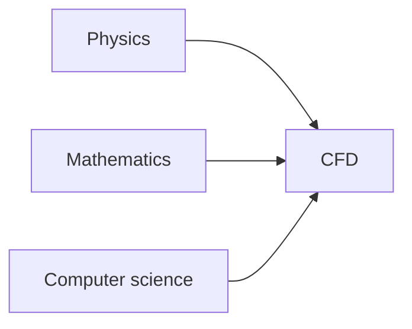
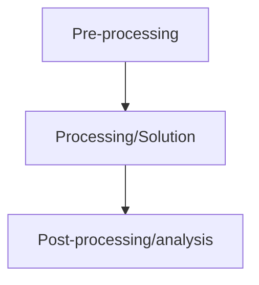

# Principles of CFD

The physics of a fluid flow are goverened by three fundamental principles:
 - Conservation of mass, $\frac{dm}{dt}=0$
 - Conservation of momentum, $\sum F=0$
 - Conservation of energy

Unless thermal exchange is relevant, conservation of energy can be disregarded.

## Requirements of CFD simulations
CFD sits at the intersection of three fields:

### Physics
We require knowledge from fluid mechanics/dynamics and thermodynamics. CFD can also be used for cases where magnetism is important, so many branches of physics have some role to play in CFD.
### Mathematics
To solve the three [principles of CFD](#principles-of-cfd), we require algorithms and numerical analysis to obtain estimates of the numerical error etc.
### Computer science
Software are written to run on PCs or clusters of High Performance Computers with CPU/GPU architecture. These require computer scientists to develop hardware and software to be exploited by CFD codes.

## Phases of a CFD simulation
CFD simulation workflows can be split into three parts:

### Pre-processing
This stage includes the following activities:
- Geometry preparation and simplification if needed.
- Grid generation
